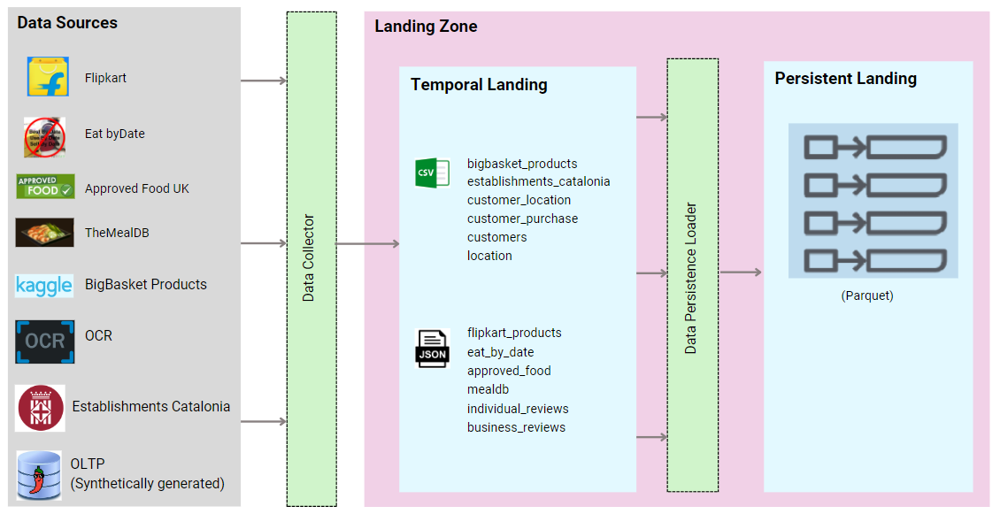

# SpicyBytes P1 Delivery : Landing Zone

## Introduction
SpicyBytes is an innovative food and grocery management platform aimed at reducing food wastage by offering a sustainable shopping and selling experience for groceries nearing their expiration date. 

## Structure of Data in the repository

```plaintext
├───.github
│   └───workflows
├───dags
│   ├───allminogcs.py
│   ├───collector.py
│   ├───etl_exploitation_zone.py
│   ├───etl_formatted_zone.py
│   ├───expiry_notification.py
│   └───synthetic.py
├───data
│   └───raw
├───landing_zone
│   ├───collectors
│   │   ├───approved_food_uk
│   │   │   └───approvedfood_scraper
│   │   │       └───approvedfood_scraper
│   │   ├───big_basket
│   │   ├───catalonia_establishment_location
│   │   ├───customers
│   │   ├───eat_by_date
│   │   ├───flipkart
│   │   │   └───JSON_files
│   │   ├───meal_db
│   │   │   └───mealscraper
│   │   │       └───mealscraper
│   │   └───OCR
│   │       ├───images
│   │       └───output
│   └───synthetic
│       ├───customer_location
│       ├───customer_purchase
│       ├───sentiment_reviews
│       └───supermarket_products
├───formatted_zone
│   ├───business_review_sentiment.py
│   ├───customer_location.py
│   ├───customer_purchase.py
│   ├───customer_sales.py
│   ├───customers.py
│   ├───dynamic_pricing.py
│   ├───establishments_catalonia.py
│   ├───estimate_expiry_date.py
│   ├───estimate_perishability.py
│   ├───expiry_notification.py
│   ├───individual_review_sentiment.py
│   ├───location.py
│   └───mealdrecomend.py
├───exploitation_zone
│   ├───dim_cust_location.py
│   ├───dim_date.py
│   ├───dim_product.py
│   ├───dim_sp_location.py
│   ├───fact_business_cust_purchase.py
│   ├───fact_business_inventory.py
│   ├───fact_business_review.py
│   ├───fact_cust_inventory.py
│   ├───fact_cust_purchase.py
│   ├───fact_customer_review.py
│   └───schema.txt
└───readme_info
```

## Data Sources

The `data` folder stores the raw data scraped using the scripts present in the `landing_zone`. The `landing_zone` consists of 2 types of data generation scripts:
- `collectors` consist of data sources that have either been scraped or extracted through API requests from the corresponding webpages.
- `synthetic` directory consists of data generated synthetically; using a composite of collected data sources and fake data generated using the python [Faker](https://pypi.org/project/Faker/0.7.4/) library.


## How to run the code

- To execute the program, clone the repository.
- Install the requirements using `pip install -r requirements.txt`.
- **Configure Airflow** : Set up your Airflow environment by configuring settings such as the executor, database, and authentication method. Refer to the Airflow documentation for detailed instructions on configuring Airflow.
- Verify that `Apache Airflow` is installed in your local machine and is running.
- Start the Airflow webserver and scheduler using the following commands:
  ```
  airflow webserver --port 8080
  airflow scheduler
  ```
- **Access the Airflow UI**: Open your web browser and navigate to http://localhost:8080.
- Enable your DAG.

The `collector.py` DAG collects data on a monthly basis, while the `synthetic.py` DAG collects data on a daily basis.


## High Level Data Architecture



The proposed high level architecture is employed for the P1 delivery methodology.


# SpicyBytes P2 Delivery : Formatted Zone and Exploitation Zone

## DAGs

We have created several DAGs to manage the workflows within the following zones:

1. **Formatted Zone**
   - Manages the tasks related to data formatting and standardization.
   - Sends formatted files to Google Cloud Storage.
2. **Exploitation Zone**
   - Handles data exploitation, including analysis and transformation tasks.
   - Sends data to BigQuery and connects to Google Looker for further analysis and visualization.
3. **Landing Zone**
   - Manages the initial data landing, ingestion, and raw data handling.

## How to Use

1. **Setting Up**: Ensure all dependencies are installed and the environment is configured properly.
2. **Executing DAGs**: The DAGs can be executed via the Airflow scheduler. Ensure the Airflow server is running and the DAGs are enabled in the Airflow UI.
3. **Monitoring**: Monitor the execution of the DAGs through the Airflow UI for any errors or required interventions.

